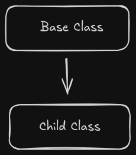
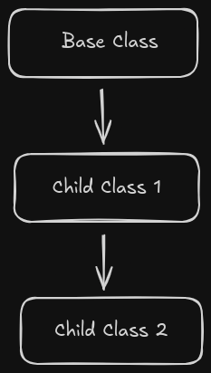
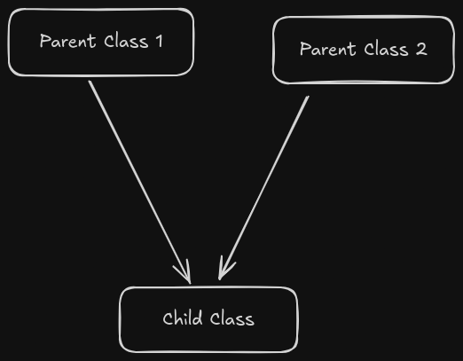

# Core Java

- Java is $platform$ $independent$, i.e, It will run irrespective of the OS and underlying hardware of the device
- It requires the JVM installed on the machine, to run Java code
- JVM is $Platform$ $dependent$


## Basic Installation:
    - Download and install JDK 
    
    - Add the JDK's bin location in the PATH env variable
    
    - Restart the terminal, and verify the Java installation, using ->
        
            => java --version  
            => javac --version
        
        
## jshell

    - Write `jshell` command in the terminal to work with java from the terminal only

    - We can execute java code in the terminal using jshell

    - To exit the jshell, type ->

            => /exit  

>Note -> We can write the commands directly, in the jshell and need not write the entire class declaration  


## Compiling Java Files

    - To compile a java file, go to the desired folder and type ->

            => javac <file-name.java>

## Running the compiled Java Files

    - To run a java program, use the following command ->

            => java <className> 

## Flow


## Variables

### Declaration

    <data_type> <variable_name>;

e.g.->  int num;

### Initialization

    <data_type> <variable_name> = <value>;

e.g.-> int num = 10;


## Data Types

### 1. Primitive

    Integer -> byte, short, int, long
    Float -> float, double
    Character -> <all characters>
    Boolean -> true/false

>Note-> The default Data Type for decimal values in Java is **double**

A double value can be defined as ->

    double num = 5.6;

But, we can't define a float value, like mentioned above, we need to add a *f* after the value, as ->

    float num = 5.6f;


>Note-> char in java takes 2 bytes, as Java follows *UNICODE* instead of ASCII, and a character needs to be enclosed in single quotes only.


## Type Conversion and Casting

### - Explicit Type Conversion (Type Casting)

We can explicitly type cast a value of some data type to another, like ->

    type_1_variable = (data_type_2) value_of_type_2;

e.g.-> 

    int int_val = 45;
    byte b = (byte) int_val;

>Note-> If we try to type cast a higher value than the range of the data_type, then It will Modulo(%) the value with the range of the data_type (for byte -> 256) and store the remainder in the variable

e.g.

    int a = 258;
    byte b = (byte) a; 

    Value of b => 2 (258 % 256 = 2)
    

### - Implicit Type Conversion

A value is automatically converted to a higher order data_type of same type, like

e.g. ->

    byte b = 44;
    int a = b;

## Classes & Objects

In Java, **JVM** is responsible to **create Objects**, using a Blueprint, i.e., a Class file

To create an object of a class named, "MyClass" type ->

> MyClass obj = new MyClass();

A Class has 'attributes' and 'member functions' (or 'methods')

### Method Overloading

When the same method name, under a single class, is defined multiple times, depending on the number of parameters, data type of parameters, return type of method


``` java
class AddCalc{
    public int add(int n1, int n2){
        return n1+n2;
    }
    public int add(int n1, int n2, int n3){
        return n1+n2+n3;
    }
    public double add(double n1, int n2){
        return n1+n2;
    }
}

class MethodOverloading {
    public static void main(String args[]){
        AddCalc cd = new AddCalc();
        System.out.println(cd.add(5.8, 88));
    } 
}

```

### Some terminologies

``` Java
class Calculator{
    int num; // Instance Variable    

    public int addNums(int n1, int n2){
        // n1 and n2 are local variables
        return n1+n2;
    }
}

class Terms{
    public static void main(String args[]){
        Calculator obj = new Calculator();
        // obj is a 'Reference Variable'
        int r1 = obj.addNums(10, 20);
        System.out.println(r1);
    }
}

```

Here, 

1. Variable 'num' is *Instance Variable* of the 'Calculator Class' 
2. The variables 'n1' and 'n2' are the *Local Variables* of the 'addNums method'
3. The variable 'obj' is a *Reference Variable*, which refers to the location/address in the (Heap) Memory where the Object of the Calculator class is created
4. Each Object has the Instance Variables' in the Heap Memory along with the method definitions

## Arrays
* Arrays can be declared/defined as follows -
       
        int[] arr = {1,2,3,4};

        OR 

        int[] arr = new int[4];

* A 2-D array is declared as -

         int[][] nums = new int[3][4];
         // int[rows][cols]

* A Jagged Array is an array, where each row can have different number of values -

        int[][] nums = new int[3][];

        nums[0] = new int[3];
        nums[1] = new int[4];
        nums[2] = new int[2];

    Here we need to define the size of each row indivisually

## String

* In Java, String is a class and not a primitive data type, and is declared as -
    
    > String name = "xyz"

* Strings are Immutable in nature, i.e, once created, they can't be changed

* We can have Mutable Strings in java, using _StringBuffer_ or _StringBuilder_

## StringBuffer

* StringBuffer can be declared just like another class Object -

    > StringBuffer sb = new StringBuffer("xyz")

* StringBuffer gives us extra 16 bytes of memory in advance, and the string added, adds to this 16 bytes size

* These 16 bytes, acts as a buffer, in case, to avoid relocation, when the string is updated

* Once defined the value, the Capacity of the StringBuffer doesn't change

* We can redefine the length using the setLength function

* StringBuffer is *thread safe* and StringBuilder is not


## INHERITANCE

* In Java, We inherit a class using `extends` keyword, as ->

    > public class child extends parent{}

* We don't need the parent class' java file, If we have the compiled, .class file of the parent

### Single Inheritance -



### MultiLevel Inheritance -



## IMPORTANT 

* In Java, `Multiple Inheritance` is `NOT ALLOWED`



* This is bcoz, When we call a member function, from an object, Java first searches the child's class, then go in the upward direction, in inheritance and wherever the function is found first, it is execute
* In case of Multiple inheritance, If both the parents have the same function, which one will be called?
* Due to this `Ambiguity Problem`, Java doesn't support Multiple Inheritance

## super() -

* `Every Class Inherits the Object class`
* Every constructor has a function call, `super()`, at the first line
* `super()` calls the constructor of the parent class

## this() - 

* `this(), Calls the constructor of the same class`

## Importing Packages -

* Making a package = Adding a java file in a folder
* We can import a class from a package, using ->
    
    `import <package_name>.<class_name>;`

* To import all classes from a package ->

    `import <package_name>.* ;`

## `final` Keyword 

* final can be used for - variable, class, method   
* `final is used to make constants`
* Its like, `const keyword` of Java

* final <var> = make the variable, constant, can't change its value
* final <class> = No other class can inherit this class
* final <method> = Can't be overridden

## OBJECT ORIENTED LANGUAGE

* **Java is not purely Object Oriented Language**
* *In an Object Oriented Language, Everything should be an Object*
* In Java, Everything is an Object (Every class extends Object), except **Primitive Data Types**
* Primitive Values like Int, float, are Primitive Types, and not Object Types
* It helps Java, improving performance, as these primitive values are not stored in Heap as Object, etc

## Wrapper Class

* Classes that extend the object class, for the Primitive Types
* Like, int -> Integer() or char -> Character() or double -> Double()

* **BOXING** = *Storing a primitive value in a Wrapper Class Object*
* **AUTO BOXING** = *Storing the primitive value in a Wrapper Class Object, where It automatically converts the primitive value to class object*
* **UNBOXING** = *Getting the value from an Object Type to a Primitive Type*    
* **AUTO UNBOXING** = *Allowing the Unboxing to happer Automatically*

* e.g.-> 

        int num = 9;

        // BOXING
        Integer num1 = new Integer(num);

        // AUTO BOXING
        Integer num2 = num;

        // Get the value of the Integer class Object
        // UNBOXING
        int num3 = num2.intValue();

        // AUTO UNBOXING
        int num4 = num1;
    

## Abstract Class/Method

* Whenever, you want to declare some features, but dont want to implement these, in the parent class
* You want the child classes to implement these features, then you use the *abstract* keyword
* *You can't create an Object of an Abstract Class*
* *But you can create a reference of the Abstract Class*
* Note 1 - **Its not mandatory for an Abstract Class to have Abstract Methods**
* Note 2 - **If we are declaring an Abstract method, then it is mandatory to have it inside an Abstract Class**
* Note 3 - **It is mandatory for the Child class to implement all the Abstract methods for the Parent Class**
* Note 4 - **In Case, the Child class is also not able to implement all the abstract methods of the parent class, then the child class also becomes an Abstract Class**
* Note 5 - **Non Abstract Classes are Called Concrete Classes**