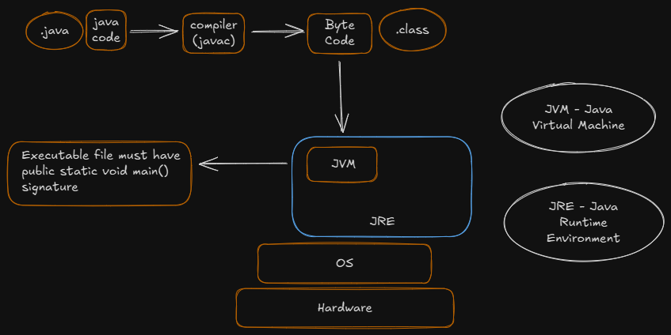

# Core Java

- Java is $platform$ $independent$, i.e, It will run irrespective of the OS and underlying hardware of the device
- It requires the JVM installed on the machine, to run Java code
- JVM is $Platform$ $dependent$

## Basic Installation:
    - Download and install JDK 
    
    - Add the JDK's bin location in the PATH env variable
    
    - Restart the terminal, and verify the Java installation, using ->
        
            => java --version  
            => javac --version
        
        
## jshell

    - Write `jshell` command in the terminal to work with java from the terminal only

    - We can execute java code in the terminal using jshell

    - Note -> We can write the commands directly, in the jshell and need not write the entire class declaration

    - To exit the jshell, type ->

            => /exit    

## Compiling Java Files

    - To compile a java file, go to the desired folder and type ->

            => javac <file-name.java>

## Running the compiled Java Files

    - To run a java program, use the following command ->

            => java <className> 

## Flow
