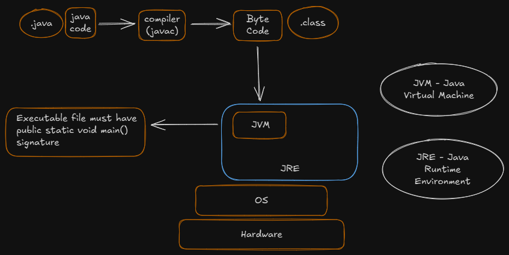

# Core Java

- Java is $platform$ $independent$, i.e, It will run irrespective of the OS and underlying hardware of the device
- It requires the JVM installed on the machine, to run Java code
- JVM is $Platform$ $dependent$


## Basic Installation:
    - Download and install JDK 
    
    - Add the JDK's bin location in the PATH env variable
    
    - Restart the terminal, and verify the Java installation, using ->
        
            => java --version  
            => javac --version
        
        
## jshell

    - Write `jshell` command in the terminal to work with java from the terminal only

    - We can execute java code in the terminal using jshell

    - To exit the jshell, type ->

            => /exit  

>Note -> We can write the commands directly, in the jshell and need not write the entire class declaration  


## Compiling Java Files

    - To compile a java file, go to the desired folder and type ->

            => javac <file-name.java>

## Running the compiled Java Files

    - To run a java program, use the following command ->

            => java <className> 

## Flow


## Variables

### Declaration

    <data_type> <variable_name>;

e.g.->  int num;

### Initialization

    <data_type> <variable_name> = <value>;

e.g.-> int num = 10;


## Data Types

### 1. Primitive

    Integer -> byte, short, int, long
    Float -> float, double
    Character -> <all characters>
    Boolean -> true/false

>Note-> The default Data Type for decimal values in Java is **double**

A double value can be defined as ->

    double num = 5.6;

But, we can't define a float value, like mentioned above, we need to add a *f* after the value, as ->

    float num = 5.6f;


>Note-> char in java takes 2 bytes, as Java follows *UNICODE* instead of ASCII, and a character needs to be enclosed in single quotes only.


## Type Conversion and Casting

### - Explicit Type Conversion (Type Casting)

We can explicitly type cast a value of some data type to another, like ->

    type_1_variable = (data_type_2) value_of_type_2;

e.g.-> 

    int int_val = 45;
    byte b = (byte) int_val;

>Note-> If we try to type cast a higher value than the range of the data_type, then It will Modulo(%) the value with the range of the data_type (for byte -> 256) and store the remainder in the variable

e.g.

    int a = 258;
    byte b = (byte) a; 

    Value of b => 2 (258 % 256 = 2)
    

### - Implicit Type Conversion

A value is automatically converted to a higher order data_type of same type, like

e.g. ->

    byte b = 44;
    int a = b;

## Classes & Objects

In Java, **JVM** is responsible to **create Objects**, using a Blueprint, i.e., a Class file

To create an object of a class named, "MyClass" type ->

> MyClass obj = new MyClass();

A Class has 'attributes' and 'member functions' (or 'methods')

### Method Overloading

When the same method name, under a single class, is defined multiple times, depending on the number of parameters, data type of parameters, return type of method


``` java
class AddCalc{
    public int add(int n1, int n2){
        return n1+n2;
    }
    public int add(int n1, int n2, int n3){
        return n1+n2+n3;
    }
    public double add(double n1, int n2){
        return n1+n2;
    }
}

class MethodOverloading {
    public static void main(String args[]){
        AddCalc cd = new AddCalc();
        System.out.println(cd.add(5.8, 88));
    } 
}

```